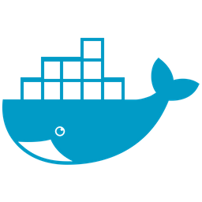

### Hi, I'm Israel, aka [Churritzu](https://twitter.com/@churritzu) and I try to learn about anything (especially technology) because in my experience everything we learn and share helps those around us. :smile:

In my 18 years of experience I have had few professional opportunities to apply new technologies, but I have also really enjoyed learning them.

## Tools

## Languages

## Clouds and VPS

## Goals >= 2020
- Get better on Go
- Contribute more to open source projects
- Learn more :smile:

## Are you looking to talk?, Here I am to talk

---
# HAPPY CODING...
